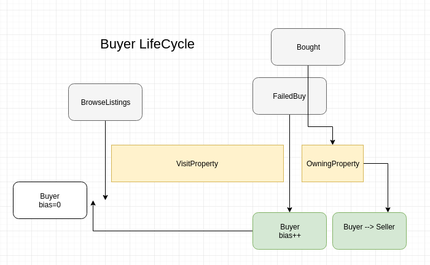
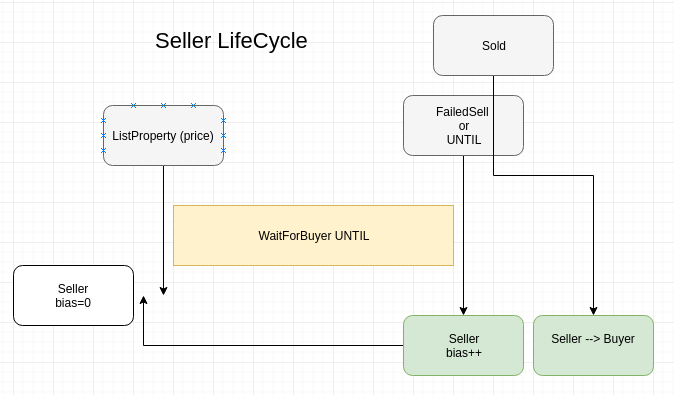
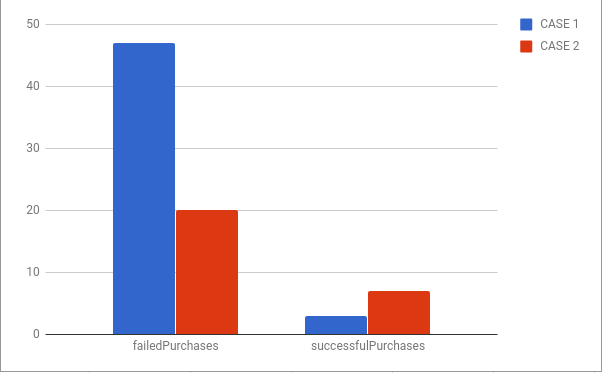
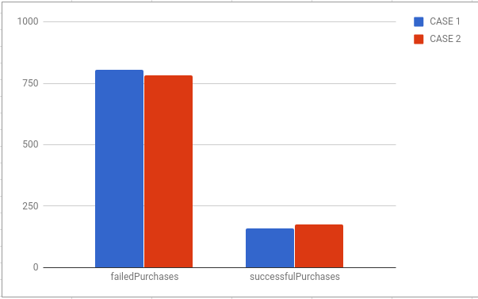

# Project 1 Proposal - Housing Markets in a Market Economy:house:

*Housing markets are complex, and a discrete event simulation lends itself to modeling how different forces and individuals' decisions affect the market as a whole.*

## Project Description

**SUI (System Under Investigation)** : Housing Market in Market Economy

### The Problem

How can one model the development of the housing market and the time to buy/sell for the average person in the market?

**Possible Insights**:

- Hown does a simple supply/demand economy trend long term?
- How do people's willingness to negotiate affect the time a house could be on market?
- Would prices trend a certain way if buyers are more likely to compromise over sellers?
- How often is a home expected to be sold if its initial price is relatively low in the market?


**Goals**:

- model the process of the housing market by simulating potential sales and listings of properties
- using a discrete event simulation, NOT time-stepped, in order to focus on how events themselves affect variables in the simulation
- include phenomena common to housing markets such as:
  - housing purchases / sales
  - willingness to compromise on a sale
  - buying/holding
  - Buyers becoming sellers, sellers becoming buyers
  - browsing houses as a time-cost

- Give insight into the time frame of a property


## Conceptual Model

The model is based on the model provided by [An Empirical Stationary Equilibrium Search - Model of the Housing Market](https://home.gwu.edu/~pcarrill/research_files/CarrilloHousingSearch.pdf). I have adapted it to fit the ABCmod implementation

### Overview
The housing market is modeled as a **service** that can take a **Person** who can be a **buyer** or a **seller** and connect them for a potential sale. The market pulls from **queues** of the buyers and sellers and calculates the sales of homes.  
**Sellers** and **buyers** have distinct predispositions to favor selling or buying quickly, modeled with attribute **bias**. These are randomly generated per person.  
A home's value is determined by its attribute **features** which is a set of **resources** having a predefined utility or value, as well as the **land** value that it sits on.

**What's Modeled**:

- Housing purchases / sales
- Liklihood of sale of a home
- Sellers increase in willingness to compromise over time to a lower price
- Buyers increase in willingness to compromise over time to a higher price
- value of homes initialized from a random distribution from a given base value

**What's Abstracted or Ignored**:

- **Value in location**: we assume this is baked into house prices already. Accounting for this would introduce more explicit complexity when it can be abstracted into housing values.

- **Uniqueness of houses or neighborhoods**: There is no differences in houses by the ways of features of the house that one person may favor over other features.

- **Stability of housing market**: we allow for a parameter to control the overall trend of the market by affecting demand, and the values of the houses are determined by the demand, so simulating a recession or crash is solely determined by that parameter. No foreclosures are modeled to prevent needing to account for home loans.

- **Distribution of houses**: we assume a very simple distribution of houses, where they are all equidistant from each other. This is to allow the model to focus on the system of supply/demand and parameters rather than area specifics. All houses are modeled to have the same capacity of 1 for simplicity. All houses have a randomness to the initial value of them when the simulation starts


### ABCmod Implementation
*see Appendix for ABCmod entity and activity tables*

**Overview of Entities**:

- **Seller** (Consumer) - a seller in the market, has attributes **postingPrice**: the price listing for sale, **bias**: the bias towards a faster sale (getting less)

- **Buyer** (Consumer) - a buyer in the market. Has attributes **budgetPrice**: the preferred max budget, **bias** the bias towards a faster sale (paying more). Has actions **visitHome**-visit a home with fixed cost **TravelCost**

- **Market** (Service) - computes the likelihood that a sale will go though, triggers events from buyers and sellers

- **Buyers** Queue - list of buyers
- **Sellers** Queue - list of sellers

**Parameters**
- NumBuyers: number of buyers allowed in the Buyers Queue
- NumSellers: number of sellers allowed in the Sellers Queue
- InitialBias: willingness to compromise with price (buyer or seller)
- runtime: max length of the simulation timestamp
- CommissionRate: cost in percent for real estate agent commission
- InterestRate: cost in percent of purchase price to finance home, affects buyer's budget
- FixedSaleCost: fixed cost to buyer to sell any home


**Events and Actions**:

- Buyer:
  - browseLisings: buyer decides which housed to visit
  - failedBuy: buyer visted house but failed to buy
  - Bought: buyer bought the house and is removed from the buyers list

- Seller:
  - listProperty(price) : list property on market with price
  - failedSale: sale failed and will increase bias towards selling for less
  - sold: sold the house, removed from the market


**Activities**:

- Buyer: 
  - **BrowsingLisings**  
    :family::dollar:---------------------------------------------------> :house:  
BrowseListings ------------ browsingLisings -------------------- failedBuy | Bought

  - **Owning**  
    :family:=>:House:---------------------------------------------------> :house:=>:family:  
Bought ------------ Owning -------------------------------------------- ListsHouse

- Seller:
- -**WaitingForSaleUNITL**
- ListsProperty ------------------ WaitingForSaleUntil ----------------- FailedSale | Sold

**LifeCycle Diagrams**:




# Software Report:
The implementation was done using TypeScript

## Code Paradigms
Using an object orientated structure, one file, `house.ts` contains the discrete event simulation that run on an engine in the file `housing-engine.ts`. This engine is a transcribed version of the airplane sim that listed in the resources of this class.  

All parameters are set in the config file `config.ts` in the **params** object, and should be modified there. Notice the structure of the config object: 
```javascript
const params = {
  commissionRate: .03,
  travelCost: 100,
  initialBias: 0,
  FixedSaleCost: 500,
  numBuyers: 100,
  numSellers: 10,
  runtime: 10000,
}
```

A Buyer is a class that has a randomly assigned buying price for which he is looking to buy a property. Upon being requested to browse listings, he will determine which properties to visit based on the price range. There is an incurred cost of travel and time, so not every property can be visited. This variable is handled by the parameter **TravelCost**.
When a `Buyer` is created using the `new Buyer` syntax, certain properties are automatically populated into the class, as can be seen here:
```javascript
class Buyer {
  constructor(
    public bias:number=genBias(),
    public budgetPrice:number=genBudgetPrice(),
    public name:string=genName(),
    public time:number=0
  ){
    console.log(`Buyer  ${this.name} has entered the market!`)

  }
  ...
```

these properties are set using "gen-erator" functions, which are global in scope, and mostly generate random values to make unique `Buyers` and `Sellers`. See `genName` here:
```javascript
function genName():string{
  let firsts = ['Mike','Sam','Bill','John','Ben','Emanuel','Chris','Stacey']
  let surs = ['Smith','Wells','Orms','Brown','Banks','Davis','Barns','Davey','Harvey','Oswald','Rice-aroni','Sanders']
  let name = firsts[Math.floor(Math.random()*firsts.length)] + " " +
  surs[Math.floor(Math.random()*surs.length)]
  return name
}
```

In order to make sim results more eadable, an alternative to the above assigns `P1, P2, P3...` as names to the Buyer/Sellers using a `Clojure`(function with state)
```javascript
var genName = (() => {
  let count = 0
  return () => {
    return "P" + count++
  }
})()
```


The queues for the sellers is a singleton named SellerQueue and contains code for scheduling events to spawn sellers into the queue, and thus set the listings in the market.  
The BuyerQueue is a singleton that similarly does this for buyers, however, it also schedules events for telling buyers to start browsing home listings to potentially visit.

The simulation begins by the Buyer and Seller queues spawning the objects, and it is ended when the engine's simulation time surpasses that of the **param.runtime** parameter.

## FEL - Event Engine
Probably the most amazong feature of using TypeScript is the ability to throw around functions like they're variables. I utilized this to simplify my engine, which is **singly linked list** data structure based on the **Airport Simulation** provided by the resouce materials. An `Engine` is instantiated at the beginning of the sim, and When the method `.schedule(timestamp, function)` is called, the **FEL** inserts the event at the correct place in the `list` by doing a naive seach. When an event is finished being processed, the `next()` one in the `list` is processed.  
I made some changes to a traditionally structured FEL though- no longer does my `Engine Event` include a `data` property, simply a `timestamp` and a callback `function`. All my Engine has to do is pick the next scheduled event and fire it. This also helps maintain references and scope on the variables that I schedule events on. Check it out:
```javascript
console.log(this.name + ' visited property')
    engine.schedule(engine.currentTime()+5,()=>{

      let sold : number
      let diff = seller.postingPrice - this.budgetPrice
      let sellerLeeway = seller.bias*1000
      let buyerLeeway = this.bias*1000
      if (diff < 0) { //if buyer gets a good deal
        if (Math.abs(diff) > sellerLeeway) {
          engine.schedule(engine.currentTime()+5, ()=>{ //event scheduling-CEPTION
            seller.failedSale()
            this.failedBuy()
          })
        }
```
Notice how this enables the nesting of scheduled events, without having to define more functions and pass variables around! Maintain the scope, and nest events at the same time!


# Validation and Verification

It's important that the software to go along with the proposal matches what's specified in the Conceptual Model, this is refered to as **Verification**. I will test verification by walking through sample output logs and comparing them to lifecycle diagrams.

For the Buyer, we make sure that the progression goes: `Buyer(small bias) -> BrowseListings -> visitingHomes -> FailedBuy OR Bought`

In `config.ts` we set `filerLogs = 'P5'`:
```javascript
params = {
  ...
  ...
  filterLogs = 'P5'
}
```

 in order to only get the logs for person 5, and here's a sample run:
 ```
 Buyer P5 has entered the market
 Buyer P5 is browsingListings
P5 bought from P6 for $9489.3432
...
Buyer  P5 has entered the market!
```

Notice how this person is a `Buyer` and follows the lifecycle of one, as layed out in the Conceptual Model

For the Seller , we make sure that the progression goes: `Seller(small bias) -> BrowseListings -> waitingForSale -> FailedSell OR Sold`
 in order to only get the logs for person 6, and here's a sample run:
 ```
 Seller P6 has entered the market at $9523
 Seller P6 is waiting for a sale
 Seller's bias increased
 Seller's bias increased
P7 bought from P6 for $9098.534345412439
...
Buyer  P6 has entered the market!
```
Notice how the `Seller` progression follows clearly with the lifecycle diagram shown in the appendex alongside the ABCMod tables. He `waitsUntil` a buyer or the designated time has passed, and then will settle for a lower price than the initial offering.

Similarly, at the end of the simulation, we can log whatever we want in order to verify the simulation went as expected. One of these logs includes logging the `length` property of the `buyersQueue` and the `sellersQueue`. If we set the `config.ts` value `numBuyers: 10`, we should see that reflected in the logs.

For **Validation**, this also seems to model a real life supply and demand economy, since a seller who can't find a buyer is likely to decrease the price of the item.


## Experiments and Conclusions:
There were a few experiments I did with the simulation, which involved tweaking the parameters and runtime of the discrete event simulation (in the form of a max time stamp). These consisted of the following:

### Experiment #1 - Sellers/Buyers Biases
#### Question: "How does the eagerness of the general Buyers and Sellers affect the rate of sales of homes?"

**Approach**: By manipulating the `inialBias` parameter we can tweak the simulation to represent a more eager market. This experiment keeps constant the supply vs. demand, and examines the role of eagerness in a market economy.  
In order to do this, I examine the effects of `initialBias` on two different senarios:
- Small number of Buyers/Sellers (10 Buyers/Sellers) with varried `initialBias`:
```
CASE 1                  CASE 2
initialBias:0           initialBias: .1   <-----
numBuyers:10    vs      numBuyers:10
numSellers:10           numSellers:10
runtime: 1000           runtime:1000
```

- Large number of Buyers/Sellers (150 Buyers/Sellers) with long `runtime` (10000) and varried `initialBias`
```
CASE 1                  CASE 2
initialBias:0            initialBias: .1   <-----
numBuyers:150    vs      numBuyers:150
numSellers:150           numSellers:150
runtime: 10000           runtime:10000
```

CASE 2 means sellers are able to compromise up to 10% initially on their sale negotiations

**Hypothesis**: In all three senarios, there will be a relatively large increase in the ratio of successful:failed purchases, due to bias directly affecting the percentage to which he will compromise on the budget or sale price. However, in the larger experiments, one will see a relatively lesser increase of this ratio due to a longer sim time. This would mean the `initialBias` would have lesser overall effect on the market.

**Results**:
After running 10 trials of each case, the data shows that the on average, increasing initial bias will increase ratio of bought to sold properties in both senarios. This was expected:
**Low Buyers/Sellers**  (~ 50% improvemt of ratio of successful sales)


Average Output|	CASE 1|	CASE 2|
-|-|-
totalTimeBuy|	45.2	|201.3|
totalTimeSell	|39.3|	30.4|
failedPurchases|	47.1|	20.2|
successfulPurchases	|3.23	|7.11
averageSalePrice|	8438.23|	9050.23

**High Buyers/Sellers** (~ 5% improvemt of ratio of successful sales)


 ### conclusions
 `Small Buyers/Seller` case did have a larger improvement of sold:failed ratio, most likely because of the longer sim time, thus allowing more time for sellers and buyers to increase their bias values over time. This simulates the effects of a market in real life, because the longer a set amount of buyers and sellers exist, and there is a desire to trade, more compromises are willing to be made.Therefore this follows what my expected results were.  

  However, there also was an increase in the `averageSalePrice` of the homes accross all of the trials, which leads me to believe it must be corellated to the parameter I changed. I was not expecting the ability to affect price, but I would suspect that the greater ability to compromise led to more purchases and therefore there was temporarily less supply in the market. This may have caused the `buyers` to be forced to increase `bias` more than the `sellers` on average.


### Experiment #2 - Supply/Demand Trend
#### Question: "How does the value of an assent trend long term in a free market economy with varried number of Buyers/Sellers? Buyers > Sellers, Sellers > Buyers, Sellers = Buyers"

**Approach**: By simply changing the `numBuyers` and `numSellers` parameters, we can tweak the number of buyers and sellers on any simulation run, and analyze the results of the sim based on average asset value (current listing price or last purchase price)  
To accomplish this, we manipulate the `config.ts` to have our desired params, while keeping the others constant. I will use averaged data over 10 simulations from the following configs:

LowBuyers:
```
intialBias:0
numBuyers:10
numSellers:100
runtime:1000
...
``` 

LowSellers:
```
intialBias:0
numBuyers:100
numSellers:10
runtime:1000
...
``` 

**Hypothesis**: Based on supply and demand principles, I would expect `LowSellers` to correlate to a decrease in supply and thus more buyers are going to have to compete to purchase a property. Although compettition is not baked into the simulation model, I'm expecting th45e decreased availability of the Sell listings to mean a buyer is more likely to increase bias, and thus buy a house for more money. Thus the value of the average home would go up.  
Similarly for the `LowBuyers`, the sellers will have fewer people to sell to, and thus they will end up increasing their biases more, and thus decrease the amount needed to purchase their listings.

**Results**:
**Averaged Results**:  
Case |lowest sale price | highest sale price | average sale price |
-|-|-|-
LowBuyers | $2034.32 | $8234.34 | $5023.29
LowSellers | $8002.23 | $10234.11 | $8323.41

After running 10 trials of each case, the data shows that the `LowBuyers` did infact decrease the average sale price of the homes. This, as reflected in the `saleList` output log, was caused by a gradual decrease in home values over time:
```javasscript
"soldProperties": [
      8307.5888,
      7703.1438,
      8309.248,
      7409.5276,
      7342.5434112,
      7040.866011795,
      6242.06081875,
      6004.833136474681,
      4752.6974195312505,
      3440.7059673263757,
      2183.6422060763753
   ],

```
What's suprising is that the dropoff is very steep, given the few amount of purchases that were made. This may mean my model is slightly biasing extreme results, and my not have enough randomness baked into it. In the `LowSellers` case, there was a trend upwards as predicted, but it was not nearly as steep. I am inclined to believe this is becuase a `Buyer` might be less inclined to compromise because of the way the simulation is implemented, having the buyer's update biases after browsing the listings. I was also suprised that the `standard deviation` of my results. There was a large deviation from the mean that could be accounted for in the same way as the volatile spiraling of downward pricing- not enough randomness in my model (for a dampening effect)  
Overall this agreed with my hypothesis, and seems to fit the conceptual model rather well.


## Other experiments, (but not fully documented)
- Manipulating the sellers and buyer intial `bias` values would affect how likely homeowners are to compromise on a sale value.
- Changing the base biases of the Buyers and Sellers individually:
this made the buyers more willing to pay more for a property and thus less likely to fail at a sale. When changing the initial biases, which originally were a simple random distribution from 0-1 that would multiply a $1000 base allowance for compromises.  
Decreasing this value resulted in fewer failed purchaes overall, as both parties were able to compromise to a greater extent
- changing the max timescale of the sim:
I noticed that changing the max timestamp of the sim had diminishing returns on the amount of sales that could become processed with a fixed number of buyers and sellers. However, it was more likely that all listings were purchased with a longer timescale
- With increased paperwork costs:
Houses were more likey to fail, yeilding a much larger "failedPurchases" number.


## Appendix

**Entities**:

Consumer Class: Buyer ||
|-|-|----------|
|one of many buyers ||
**Attribute**| **Description**|
value : num| determined by buy price and events  |
budgetPrice : enum(owner \| renter \| empty)| type of inhabiter|
bais : list(houses)| willingness to compromise|
...
|Consumer Class: Seller ||
|-|-|-
one of many people who buy/sell/live in houses|
**Attribute**| **Description**
willingToBuyFor : num| how much one is willing to pay. Decreases significantly after house purchase
willingToSellFor : num | how much one is willing to sell for, increases significantly after house purchase, decreases over time closer to housing value (willing to move increases).
...
|Service: Market | |
|-|-----|
a queue of Houses looking to be sold|
**Attribute**| **Description**
houseList : list(houses) | Houses currently on the market
timeLastSold : time | time elapsed since last home sale
...
Queue Urnary: Buyers ||
|-|-|
a queue of Persons looking to buy a house|
**Attribute**| **Description**
personList : list(persons) | Persons currently in the market
...
Queue Urnary: Sellers ||
|-|-|
a queue of Persons looking to buy a house|
**Attribute**| **Description**
personList : list(persons) | Persons currently in the market
...

**Constants**:  
n/a  
...

**Parameters**:
Name|Description|Value
|-|-|-
numSellers| number of sellers in market | constant
NumBuyers| num of buyers in market| constant
initialBias| initial willingness to compromise| percent variable (%)

**Activities : Buyer**

Activity: Buying||
-|-
Person enters the market for a house |
initiating event| LooksToBuy
duration| conditional
Terminating event | HouseSold

Activity: Owning||
-|-
house is currently sitting with certain inhabitants|
conditional|
initiating event| HouseInhabitantsChange
duration| conditional (HouseInhabitantsChange \| HouseSold)
Terminating event | HouseValueChange

**Activities : Seller**

Activity: WaintingForSale||
-|-
house is currently being renovated|
scheduled|
initiating event| Renovates
duration| Renovation_Time
Terminating event | HouseValueChange


References:
[An Empirical Stationary Equilibrium Search - Model of the Housing Market](https://home.gwu.edu/~pcarrill/research_files/CarrilloHousingSearch.pdf)
[Modeling of the housing market](https://files.stlouisfed.org/files/htdocs/wp/2012/2012-022.pdf)


